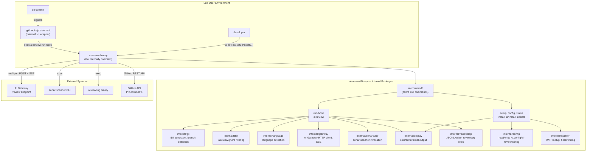
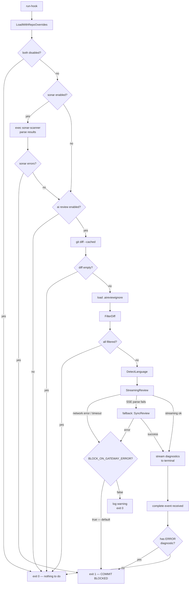

# System Design & Architecture

## Architecture Overview

> **Package naming convention**: All shared packages live under `internal/` — this is enforced by the Go compiler to prevent external import, which is correct for a CLI tool's internal logic. The diagram uses `internal/` throughout.



**Key components and responsibilities:**
- `internal/cmd/` — Cobra-based CLI entry points; thin orchestrators that call internal packages
- `internal/git` — Git operations: diff extraction, branch/remote detection, author info, per-repo git config
- `internal/filter` — `.aireviewignore` pattern matching (gitignore-style glob via `doublestar`)
- `internal/language` — Language detection from diff file extensions and project marker files
- `internal/gateway` — HTTP client for the AI Gateway: multipart upload, SSE stream parsing, sync fallback
- `internal/sonarqube` — Invoke `sonar-scanner`, parse results, format diagnostics for display
- `internal/display` — Terminal color output with Windows/CI/no-tty compatibility
- `internal/config` — Read/write `~/.config/ai-review/config` using custom shell-format parser
- `internal/installer` — Write pre-commit hook, update PATH, detect husky/custom hooksPath
- `internal/reviewdog` — Write rdjson JSONL, invoke `reviewdog` binary, post GitHub PR comments

**Technology stack:**
- Go 1.22+, `CGO_ENABLED=0` for fully static binaries
- `github.com/spf13/cobra` — CLI command structure and flag parsing
- Standard library `net/http` — SSE streaming and all HTTP requests (no external HTTP client)
- `github.com/fatih/color` — Cross-platform ANSI colors (uses `go-isatty` internally for Windows detection)
- `github.com/bmatcuk/doublestar/v4` — Gitignore-style `**` glob matching for `.aireviewignore`
- `goreleaser` — Cross-platform release builds and GitHub Release automation
- **No viper**: Configuration is read from a shell-format file via a custom parser (see `internal/config`). Cobra handles CLI flags independently.

## Data Models

### Config (`~/.config/ai-review/config`)

The config file uses shell-sourceable `KEY="VALUE"` format for backwards compatibility with existing bash-version installations. The Go binary reads this with a custom parser — **not** viper.

```go
type Config struct {
    // AI Gateway credentials
    AIGatewayURL    string `shell:"AI_GATEWAY_URL"`
    AIGatewayAPIKey string `shell:"AI_GATEWAY_API_KEY"`

    // AI model settings
    AIModel    string `shell:"AI_MODEL"`    // default: "gemini-2.0-flash"
    AIProvider string `shell:"AI_PROVIDER"` // default: "google"

    // Feature flags
    EnableAIReview  bool `shell:"ENABLE_AI_REVIEW"`       // default: true
    EnableSonarQube bool `shell:"ENABLE_SONARQUBE_LOCAL"` // default: false

    // Gateway error behavior (new field; default: block)
    BlockOnGatewayError bool `shell:"BLOCK_ON_GATEWAY_ERROR"` // default: true

    // SonarQube settings
    SonarHostURL       string `shell:"SONAR_HOST_URL"`
    SonarToken         string `shell:"SONAR_TOKEN"`
    SonarProjectKey    string `shell:"SONAR_PROJECT_KEY"`   // overridden per-repo via git config
    SonarBlockHotspots bool   `shell:"SONAR_BLOCK_ON_HOTSPOTS"`
    SonarFilterChanged bool   `shell:"SONAR_FILTER_CHANGED_LINES_ONLY"`

    // Timeouts
    GatewayTimeoutSec int `shell:"GATEWAY_TIMEOUT_SEC"` // default: 120
}
```

**Per-repo override**: `SONAR_PROJECT_KEY` and `ENABLE_SONARQUBE_LOCAL` can be overridden per-repository via git local config:
```bash
git config --local aireview.sonarProjectKey  my-project
git config --local aireview.enableSonarQube  true
```
The Go binary reads these after loading the global config and applies them as overrides (see `internal/config.LoadWithRepoOverrides`).

### Diagnostic (rdjson format — matches existing reviewdog contract)

```go
type Diagnostic struct {
    Message  string   `json:"message"`
    Location Location `json:"location"`
    Severity string   `json:"severity"` // "ERROR" | "WARNING" | "INFO"
    Code     Code     `json:"code,omitempty"`
}

type Location struct {
    Path  string `json:"path"`
    Range Range  `json:"range"`
}

type Range struct {
    Start Position `json:"start"`
    End   Position `json:"end"`
}

type Position struct {
    Line   int `json:"line"`
    Column int `json:"column"`
}

type Code struct {
    Value string `json:"value"`
    URL   string `json:"url,omitempty"`
}

type Source struct {
    Name string `json:"name"`
    URL  string `json:"url,omitempty"`
}

type ReviewResult struct {
    Source      Source       `json:"source"`
    Diagnostics []Diagnostic `json:"diagnostics"`
    Overview    string       `json:"overview,omitempty"`
    MaxSeverity string       `json:"max_severity,omitempty"`
}
```

### Git Context

```go
type GitInfo struct {
    CommitHash string `json:"commit_hash"`
    BranchName string `json:"branch_name"`
    PRNumber   string `json:"pr_number,omitempty"`
    RepoURL    string `json:"repo_url"`
    Author     Person `json:"author"`
    Committer  Person `json:"committer,omitempty"`
}

type Person struct {
    Name  string `json:"name"`
    Email string `json:"email"`
}
```

### SSE Event Types

```go
type SSEEvent struct {
    Type string          // "progress" | "text" | "diagnostic" | "complete" | "error"
    Data json.RawMessage
}
```

## API Design

### CLI Commands

```
# User-facing commands (same interface as bash version):
ai-review setup                       # Interactive credential setup
ai-review install                     # Install pre-commit hook in current repo
ai-review uninstall                   # Remove pre-commit hook from current repo
ai-review config                      # Print all config values (API key masked)
ai-review config get KEY              # Print one config value
ai-review config set KEY VALUE        # Set a config value (writes to config file)
ai-review config set ENABLE_SONARQUBE_LOCAL true  # Replaces enable-local-sonarqube.sh
ai-review status                      # Show installation state (config + hook presence)
ai-review update                      # Download latest binary (see Windows note below)
ai-review help                        # Show help

# Internal commands (called by hooks and CI — not intended for direct user invocation):
ai-review run-hook                    # Execute pre-commit review logic
ai-review ci-review                   # Execute CI/PR review logic (GitHub Actions)
```

**`enable-local-sonarqube.sh` replacement**: The `enable-local-sonarqube.sh` script's functionality is covered by:
```bash
ai-review config set ENABLE_SONARQUBE_LOCAL true
ai-review config set SONAR_HOST_URL http://localhost:9000
ai-review config set SONAR_TOKEN <token>
```
No separate subcommand is needed.

### internal/gateway — AI Gateway Client

```go
// StreamingReview posts the diff to the AI Gateway and processes the SSE response.
// onDiagnostic is called for each "diagnostic" event as it streams in.
// Returns the full ReviewResult when the "complete" SSE event is received.
// Automatically falls back to SyncReview if the SSE stream fails to parse.
func StreamingReview(
    ctx context.Context,
    cfg *config.Config,
    payload ReviewPayload,
    onDiagnostic func(Diagnostic),
) (*ReviewResult, error)

// SyncReview is the non-streaming fallback (used in CI and as SSE retry).
func SyncReview(ctx context.Context, cfg *config.Config, payload ReviewPayload) (*ReviewResult, error)

type ReviewPayload struct {
    Diff       string
    Language   string
    GitInfo    GitInfo
    AIModel    string
    AIProvider string
    Stream     bool
}
```

### internal/filter — .aireviewignore

```go
// FilterDiff removes diff blocks for files matching any ignore pattern.
// Returns the filtered diff string and the count of ignored files.
func FilterDiff(diff string, ignorePatterns []string) (filtered string, ignoredCount int)

// LoadIgnorePatterns reads and parses a .aireviewignore file.
// Returns an empty slice (not an error) if the file does not exist.
func LoadIgnorePatterns(path string) ([]string, error)
```

### internal/git — Git Operations

```go
// GetStagedDiff returns the output of `git diff --cached`.
func GetStagedDiff() (string, error)

// GetPRDiff returns the diff between HEAD and the base branch (GitHub Actions context).
// Falls back through: origin/<base> → origin/main → origin/master → HEAD~1 → staged.
func GetPRDiff(baseBranch string) (string, error)

// GetGitInfo collects author, branch, commit hash, and repo URL.
func GetGitInfo() (GitInfo, error)

// GetRepoRoot returns the absolute path to the git repository root.
func GetRepoRoot() (string, error)

// GetLocalConfig reads a per-repo git config value (git config --local).
// Returns ("", nil) if the key is not set.
func GetLocalConfig(key string) (string, error)
```

### internal/config — Config Loading

```go
// Load reads the global config file.
func Load() (*Config, error)

// LoadWithRepoOverrides reads the global config then applies per-repo
// git config overrides (aireview.sonarProjectKey, aireview.enableSonarQube).
func LoadWithRepoOverrides() (*Config, error)

// Save writes the config struct back to the config file in shell KEY="VALUE" format.
func Save(cfg *Config) error

// ConfigDir returns the platform-appropriate config directory:
//   Unix:    ~/.config/ai-review/
//   Windows: %APPDATA%\ai-review\
func ConfigDir() string
```

## Component Breakdown

### Pre-commit Hook Flow (`run-hook` command)



### Line Number Annotation (`showlinenum.awk` replacement)

The bash version pipes the diff through `showlinenum.awk` before sending it to the AI Gateway. In the Go binary this is ported to a pure Go function in `internal/git`:

```go
// AnnotateLineNumbers adds `+NNN:` prefixes to added lines in a unified diff,
// matching the output format of showlinenum.awk (show_header=0 show_path=1).
func AnnotateLineNumbers(diff string) string
```

No external AWK file is needed; the logic is embedded in the binary.

### Pre-commit Hook File Template

The installed hook is intentionally minimal. All logic lives in the binary:

```sh
#!/usr/bin/env sh
# AI-REVIEW-HOOK
# Managed by ai-review. Run 'ai-review uninstall' to remove.
exec ai-review run-hook "$@"
```

**Windows note**: Git for Windows always bundles `sh.exe` (via MinGW). Git hooks are always executed through this bundled shell, so the `sh` shebang works even in native Windows environments. Native PowerShell/CMD invocation of the hook is out of scope — git itself handles hook execution via its bundled shell regardless of the user's default shell.

### `update` Command — Windows-safe Self-Replace Strategy

Replacing a running executable is not possible on Windows (file is locked by the OS). The strategy:

1. Download new binary to a temp file: `ai-review.new` (same directory as the current binary)
2. On **Unix**: `os.Rename(tmpFile, currentBinary)` — atomic, works while running
3. On **Windows**: Write a small `ai-review-update.bat` file that:
   - Waits for the current process to exit (using `ping -n 2 127.0.0.1 > nul` delay)
   - Moves `ai-review.new.exe` → `ai-review.exe`
   - Deletes itself
   - Then `exec.Command("cmd", "/C", "start", "", batchFile).Start()` and `os.Exit(0)`

This avoids shipping a separate updater binary while handling the Windows lock constraint.

### Binary Distribution

| Platform | Archive | Binary name |
|---|---|---|
| Linux amd64 | `ai-review_linux_amd64.tar.gz` | `ai-review` |
| Linux arm64 | `ai-review_linux_arm64.tar.gz` | `ai-review` |
| macOS amd64 | `ai-review_darwin_amd64.tar.gz` | `ai-review` |
| macOS arm64 | `ai-review_darwin_arm64.tar.gz` | `ai-review` |
| Windows amd64 | `ai-review_windows_amd64.zip` | `ai-review.exe` |

Installer scripts:
- `scripts/local/install.sh` — simplified: detect OS/arch → download + extract binary → add to PATH
- `scripts/local/install.ps1` — Windows PowerShell: download `.zip` → extract → add to `$env:PATH`

## Design Decisions

| Decision | Choice | Rationale |
|---|---|---|
| CLI framework | `cobra` | De-facto standard in Go CLI tools; auto-generates help and usage text |
| Config file format | Keep shell `KEY="VALUE"` format with custom Go parser | Backwards-compatible — existing user configs continue working without migration |
| Config library | Custom `ParseShellConfig` (no viper) | Viper does not support shell-sourceable format; custom parser is ~30 lines |
| HTTP streaming | `net/http` stdlib with manual SSE line parser | Zero extra dependencies; SSE is a simple line protocol |
| Color output | `github.com/fatih/color` | Handles Windows ANSI detection automatically via `go-isatty`; respects `NO_COLOR` |
| Glob matching | `github.com/bmatcuk/doublestar/v4` | Correct `**` semantics that the bash `sed` approximation misses |
| Build pipeline | `goreleaser` + GitHub Actions | Standard Go release automation; checksums + archives for all platforms |
| AWK line numbering | Port `showlinenum.awk` logic to Go (`AnnotateLineNumbers`) | Removes external AWK dependency; pure Go is testable |
| Hook file | Minimal `sh` script delegating to binary | Logic lives in the versioned binary; hook file rarely needs updating |
| SonarQube enable | `ai-review config set ENABLE_SONARQUBE_LOCAL true` | No need for a separate subcommand; replaces `enable-local-sonarqube.sh` cleanly |
| Windows self-update | Batch file trampoline (no separate updater binary) | Handles OS file-lock constraint without distributing additional executables |
| Per-repo SonarQube key | Read `git config --local aireview.sonarProjectKey` | Preserves existing bash behavior; no new config mechanism needed |

**Alternatives considered:**
- **Python**: Slower startup, dependency management still painful on Windows
- **Deno**: Good binary but large size (~90MB), less familiar toolchain for the team
- **Rust**: Better performance but significantly longer compile times and steeper onboarding curve

## Non-Functional Requirements

**Performance:**
- Binary cold start (e.g., `ai-review help`): < 100ms
- Pre-commit hook overhead before network call: < 200ms
- SSE streaming: first diagnostic displayed within 2s of sending diff to gateway

**Cross-platform:**
- `GOOS=windows GOARCH=amd64`: native `.exe`, no Cygwin/MSYS required at runtime
- Config path: `%APPDATA%\ai-review\config` on Windows, `~/.config/ai-review/config` on Unix
- Hook invocation: relies on Git's bundled `sh.exe` on Windows (always present with Git for Windows)
- Hook file detection: supports `.git/hooks/`, `.husky/`, and custom `core.hooksPath`

**Security:**
- Config file written with mode `0600` (owner read/write only)
- API keys never printed in full; masked as `****` in `config` command output
- No shell injection: all subprocess invocations use `exec.Command` with `[]string` argument slices (never `sh -c "..."`)
- Temp files created with `os.CreateTemp` (random suffix, not predictable path)
- GitHub tokens read from env var only; never written to disk

**Reliability:**
- SSE parse failure → automatic retry with `SyncReview`
- Gateway unreachable / timeout → controlled by `BLOCK_ON_GATEWAY_ERROR` config (default: block)
- Partial SSE stream (connection drop mid-stream) → display diagnostics received so far, then proceed to error path
- AI Gateway timeout: controlled by `GATEWAY_TIMEOUT_SEC` config (default: 120s)
