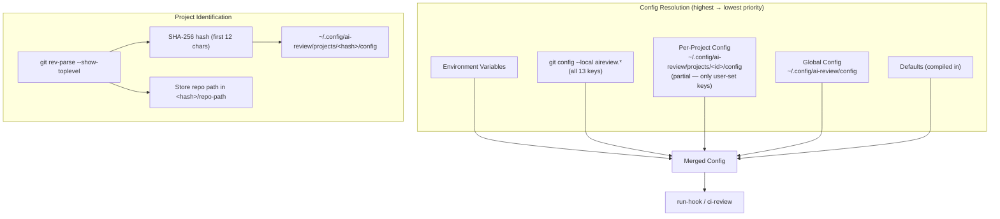

# Per-Project Configuration — System Design

## Architecture Overview



**Resolution order** (first non-empty wins):
1. Environment variables (`AI_GATEWAY_URL`, etc.)
2. `git config --local aireview.*` — expanded to support all 13 keys
3. Per-project config file (`~/.config/ai-review/projects/<hash>/config`)
4. Global config file (`~/.config/ai-review/config`)
5. Compiled defaults

**Key principle:** Merging happens at the **raw key-value map level** (`map[string]string`), not at the struct level. Each layer only contributes the keys it explicitly contains. This avoids the Go zero-value problem where `bool false` and `int 0` are indistinguishable from "not set."

## Data Models

### Project Config Directory

```
~/.config/ai-review/
├── config                          # global config (existing, full 13 keys)
└── projects/
    ├── a1b2c3d4e5f6/               # SHA-256(repo_root)[:12]
    │   ├── config                  # project config (PARTIAL — only overridden keys)
    │   └── repo-path               # plaintext: /Users/dev/myproject
    └── f7e8d9c0b1a2/
        ├── config
        └── repo-path
```

- **config**: same shell `KEY="VALUE"` format as global config — reuses existing `parseShellConfig()`. However, project config files are **partial**: they only contain keys the user explicitly set. Example:
  ```bash
  # Project config — only 2 keys overridden
  AI_MODEL="gpt-4o"
  AI_PROVIDER="openai"
  ```
  All other keys fall through to global config → defaults.
- **repo-path**: contains the full repo root path for human discoverability and `list-projects` command

### Project Identifier

```
id = SHA-256(canonicalRepoRoot)[:12]
```

- Use `filepath.EvalSymlinks()` + `filepath.Clean()` to canonicalize before hashing
- 12 hex chars = 48 bits of entropy, collision probability negligible for local use
- Filesystem-safe: only lowercase hex characters

### git-local Key Mapping

All 13 config keys are mapped to `git config --local` keys using an `aireview.` prefix with camelCase:

| Config Key | git-local Key |
|------------|--------------|
| `AI_GATEWAY_URL` | `aireview.gatewayUrl` |
| `AI_GATEWAY_API_KEY` | `aireview.gatewayApiKey` |
| `AI_MODEL` | `aireview.model` |
| `AI_PROVIDER` | `aireview.provider` |
| `ENABLE_AI_REVIEW` | `aireview.enableAiReview` |
| `ENABLE_SONARQUBE_LOCAL` | `aireview.enableSonarQube` |
| `BLOCK_ON_GATEWAY_ERROR` | `aireview.blockOnGatewayError` |
| `GATEWAY_TIMEOUT_SEC` | `aireview.gatewayTimeoutSec` |
| `SONAR_HOST_URL` | `aireview.sonarHostUrl` |
| `SONAR_TOKEN` | `aireview.sonarToken` |
| `SONAR_PROJECT_KEY` | `aireview.sonarProjectKey` |
| `SONAR_BLOCK_ON_HOTSPOTS` | `aireview.sonarBlockHotspots` |
| `SONAR_FILTER_CHANGED_LINES_ONLY` | `aireview.sonarFilterChanged` |

> **Backwards compat:** existing `aireview.sonarProjectKey` and `aireview.enableSonarQube` continue to work — same key names as before.

## API Design

### CLI Changes

```
ai-review config                         # show merged config for current project
ai-review config get KEY                 # get merged value for KEY
ai-review config get KEY --global        # get global value only
ai-review config set KEY VALUE           # set in project config (if in a repo) or global
ai-review config set KEY VALUE --global  # always set in global config
ai-review config set KEY VALUE --project # always set in project config (requires git repo)
ai-review config list-projects           # list all projects with overrides
ai-review config remove-project [ID]     # remove a project's config
```

**Behavior of `config set` without flags:**
- If inside a git repo with an existing project config → update project config (add/update that single key)
- If inside a git repo without project config → update global config (safe default)
- If outside a git repo → update global config

**Behavior of `config set --project`:**
- Creates project config directory if it doesn't exist
- Writes only the specified key to the project config file (partial write)
- Preserves other existing keys in the project config

**Behavior of `config` (no args):**
- Show merged config with source annotations:
  ```
  ========================================
    AI_GATEWAY_URL           https://my-gateway.example.com  (project)
    AI_GATEWAY_API_KEY       ****                            (global)
    AI_MODEL                 gpt-4o                          (project)
    AI_PROVIDER              openai                          (project)
    ENABLE_AI_REVIEW         true                            (default)
    ENABLE_SONARQUBE_LOCAL   false                           (default)
    ...
  ========================================

  Global config:  ~/.config/ai-review/config
  Project config: ~/.config/ai-review/projects/a1b2c3d4e5f6/config
  Project repo:   /Users/dev/myproject
  ```

### Internal Go API Changes

```go
// ── project.go ──────────────────────────────────────────────────────────────

// ProjectID returns the hashed project identifier for a given repo root.
func ProjectID(repoRoot string) string

// ProjectConfigDir returns the config dir for the current git repo's project.
// Returns ("", nil) if not in a git repo.
func ProjectConfigDir() (string, error)

// LoadProjectRaw reads the project config as a raw key-value map.
// Returns (nil, nil) if not in a repo or no project config exists.
func LoadProjectRaw() (map[string]string, error)

// SaveProjectField writes a single key-value pair to the project config,
// preserving any existing keys. Creates the directory and repo-path file if needed.
func SaveProjectField(key, value string) error

// RemoveProject deletes a project config directory by ID.
// If id is empty, uses the current repo's project ID.
func RemoveProject(id string) error

// ListProjects returns all project configs with their repo paths.
type ProjectInfo struct {
    ID         string
    RepoPath   string
    ConfigPath string
}
func ListProjects() ([]ProjectInfo, error)

// ── merge.go ────────────────────────────────────────────────────────────────

// LoadMerged loads the fully merged config (defaults ← global ← project ← git-local ← env).
// This replaces Load() and LoadWithRepoOverrides() as the primary entry point.
func LoadMerged() (*Config, error)

// ConfigSource tracks where a config value came from.
type ConfigSource struct {
    Value  string
    Source string // "default", "global", "project", "git-local", "env"
}

// LoadMergedWithSources returns each field's value and source label.
func LoadMergedWithSources() (map[string]ConfigSource, error)

// loadGlobalRaw reads only the global config file as a raw key-value map,
// without applying env vars or git-local overrides.
func loadGlobalRaw() (map[string]string, error)

// loadGitLocalRaw reads all aireview.* keys from git config --local
// as a raw key-value map (using the key mapping table above).
func loadGitLocalRaw() map[string]string

// loadEnvRaw reads all config-relevant environment variables
// as a raw key-value map.
func loadEnvRaw() map[string]string
```

### Merge Algorithm (pseudo-code)

```go
func LoadMerged() (*Config, error) {
    // Start with defaults as raw map
    merged := defaultsAsMap()       // all 13 keys with default values
    sources := initSources("default")

    // Layer 1: global config file
    if globalMap, err := loadGlobalRaw(); err == nil && globalMap != nil {
        for k, v := range globalMap {
            merged[k] = v
            sources[k] = "global"
        }
    }

    // Layer 2: project config file (partial — only contains user-set keys)
    if projectMap, err := LoadProjectRaw(); err == nil && projectMap != nil {
        for k, v := range projectMap {
            merged[k] = v
            sources[k] = "project"
        }
    }

    // Layer 3: git config --local (all 13 keys, read individually)
    gitMap := loadGitLocalRaw()
    for k, v := range gitMap {
        merged[k] = v
        sources[k] = "git-local"
    }

    // Layer 4: env vars (highest priority)
    envMap := loadEnvRaw()
    for k, v := range envMap {
        merged[k] = v
        sources[k] = "env"
    }

    // Convert merged map → Config struct
    cfg := Defaults()
    applyValues(cfg, merged)
    return cfg, nil
}
```

## Component Breakdown

### New Files

| File | Functions | Purpose |
|------|-----------|---------|
| `internal/config/project.go` | `ProjectID`, `ProjectConfigDir`, `LoadProjectRaw`, `SaveProjectField`, `RemoveProject`, `ListProjects` | Project identification, I/O, management |
| `internal/config/merge.go` | `LoadMerged`, `LoadMergedWithSources`, `loadGlobalRaw`, `loadGitLocalRaw`, `loadEnvRaw`, `defaultsAsMap` | Layered config merging with source tracking |
| `internal/config/project_test.go` | Tests for project.go | Unit tests |
| `internal/config/merge_test.go` | Tests for merge.go | Unit tests |

### Modified Files

| File | Changes |
|------|---------|
| `internal/config/config.go` | Extract `parseShellConfig()` to package-level (already is). Add `defaultsAsMap()` helper. Deprecate `Load()` → delegates to `LoadMerged()`. Deprecate `LoadWithRepoOverrides()` → delegates to `LoadMerged()`. |
| `internal/config/gitconfig.go` | Expand `gitLocalConfigImpl()` to read all 13 keys (add key mapping table) |
| `internal/cmd/config.go` | Add `--global` / `--project` flags, source annotations, `list-projects` / `remove-project` subcommands |
| `internal/cmd/runhook.go` | Replace `LoadWithRepoOverrides()` → `LoadMerged()` |
| `internal/cmd/cireview.go` | Replace `Load()` → `LoadMerged()` |
| `internal/cmd/setup.go` | Replace `Load()` → `LoadMerged()` |
| `internal/cmd/status.go` | Show project config info when available |
| `internal/cmd/install.go` | Replace `Load()` → `LoadMerged()` |

## Design Decisions

### 1. Hash-based project ID (not sanitized path)

**Chosen:** SHA-256 hash of canonical repo root, truncated to 12 hex chars.

**Rationale:**
- Filesystem-safe on all platforms (no special chars, path separators, or encoding issues)
- No collision risk at local scale
- Works even with deeply nested or Unicode paths
- Trade-off: opaque — mitigated by `repo-path` file and `list-projects` command

**Rejected:** Sanitized path (e.g., `Users-dev-myproject`) — fragile with special characters, symlinks, and Windows paths.

### 2. Same KEY="VALUE" format (not YAML/JSON/TOML)

**Rationale:**
- Reuses existing `parseShellConfig()` and `formatShellConfig()` — zero new dependencies
- Users already familiar with the format from global config
- Can be edited manually with any text editor

### 3. Partial project config (not full copy)

**Chosen:** Project config files only contain keys the user explicitly set.

**Rationale:**
- Correct layering: un-set keys fall through to global config → defaults
- If the user changes a global setting (e.g., `GATEWAY_TIMEOUT_SEC`), all projects without an explicit override automatically pick up the change
- Avoids stale defaults: a full config copy would freeze all values at creation time

**Implementation:** `SaveProjectField()` reads the existing project config map, updates/adds the single key, and writes back only the keys present. This keeps the file minimal.

### 4. Map-level merging (not struct-level)

**Chosen:** All config layers are loaded as raw `map[string]string`, merged by key, then converted to `Config` struct once.

**Rationale:**
- Solves the Go boolean zero-value problem: a key absent from a map is truly "not set," unlike `bool false` which is indistinguishable from Go's zero value
- Simplifies source tracking: each key's source can be tracked during map merge
- Reuses existing `parseShellConfig()` which already returns `map[string]string`

### 5. Default `config set` targets global (not project)

**Rationale:**
- Safe default: a user who doesn't know about project config won't accidentally create one
- Explicit `--project` flag for project-level overrides
- Exception: if a project config already exists, `config set` updates it (preserves existing intent)

### 6. Expand git-local to all 13 keys

**Chosen:** `git config --local aireview.*` supports all config keys, not just the original 2.

**Rationale:**
- Consistent with the resolution order promise — git-local should be able to override anything
- Users who prefer git-native config over project config files can use it
- Backwards compatible: existing `aireview.sonarProjectKey` and `aireview.enableSonarQube` keep the same key names

### 7. Backwards-compatible deprecation of `Load()` / `LoadWithRepoOverrides()`

**Rationale:**
- Existing callers continue to work without changes during migration
- Both functions internally delegate to `LoadMerged()`
- No migration needed for external consumers (if any)

## Non-Functional Requirements

- **Performance:** Config resolution adds ~2ms (one extra file read + multiple `git config` calls). Acceptable for a pre-commit hook. Git-local reads can be batched with `git config --local --list` to reduce to a single exec.
- **Security:** Secrets remain in `~/.config/ai-review/` with 0600 permissions. Never exposed in repo. git-local secrets are stored in `.git/config` which is also never committed.
- **Reliability:** Missing or corrupt project config falls back to global config gracefully. Each merge layer is independent — a failure in one layer doesn't prevent others from loading.
- **Portability:** Works on macOS (`~/.config/`), Linux (`~/.config/`), Windows (`%APPDATA%\`). git-local works identically on all platforms.
