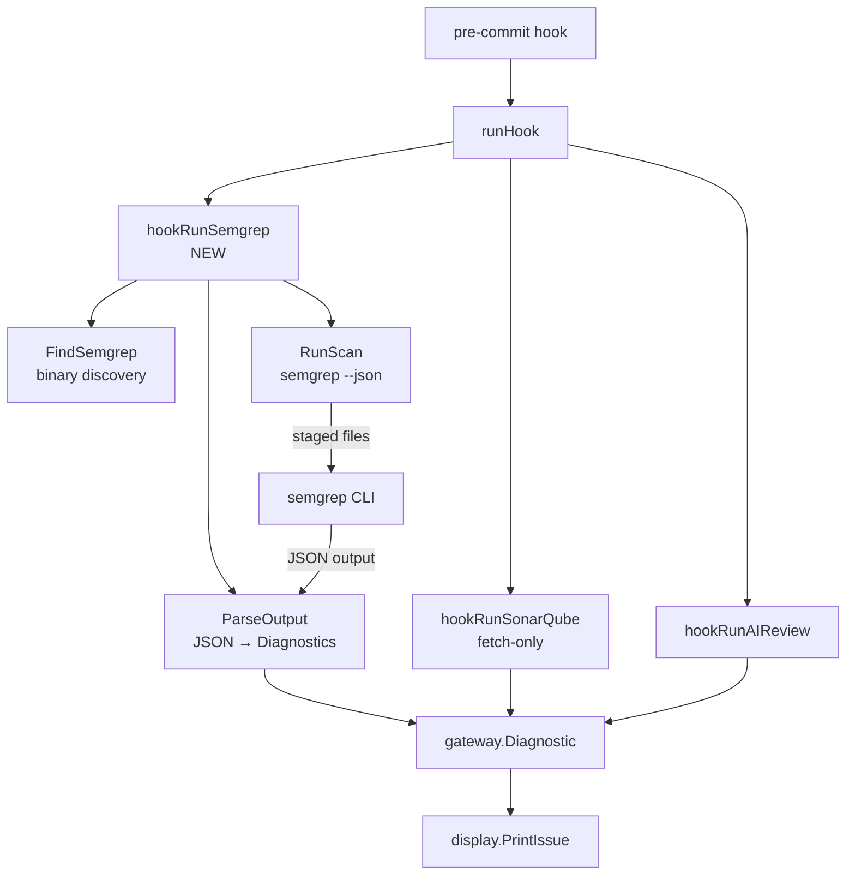

# Design: Semgrep Integration

## Architecture Overview



**Execution order in pre-commit hook:**
1. SonarQube (fetch-only) — if enabled
2. **Semgrep (local scan)** — if enabled (NEW)
3. AI Gateway review

## Data Models

### Config additions (`config.Config`)

```go
// Semgrep
EnableSemgrep    bool   // ENABLE_SEMGREP
SemgrepRules     string // SEMGREP_RULES (e.g. "auto", "p/default", ".semgrep.yml")
```

### Semgrep JSON output structure (parsed)

```go
type semgrepOutput struct {
    Results []semgrepResult `json:"results"`
    Errors  []semgrepError  `json:"errors"`
}

type semgrepResult struct {
    CheckID string         `json:"check_id"`
    Path    string         `json:"path"`
    Start   semgrepPos     `json:"start"`
    End     semgrepPos     `json:"end"`
    Extra   semgrepExtra   `json:"extra"`
}

type semgrepPos struct {
    Line int `json:"line"`
    Col  int `json:"col"`
}

type semgrepExtra struct {
    Message  string `json:"message"`
    Severity string `json:"severity"` // ERROR, WARNING, INFO
    Metadata map[string]interface{} `json:"metadata"`
}
```

## Component Breakdown

### New package: `go/internal/semgrep/`

| File | Responsibility |
|------|---------------|
| `semgrep.go` | Binary discovery, scan execution, output parsing, diagnostic conversion |
| `semgrep_test.go` | Unit tests with fixture JSON |

### Key functions

```go
// FindSemgrep returns the path to the semgrep binary.
func FindSemgrep() (string, error)

// ScanFiles runs semgrep on the given files and returns diagnostics.
func ScanFiles(bin string, cfg SemgrepConfig, files []string) ([]gateway.Diagnostic, error)
```

### Modified files

| File | Change |
|------|--------|
| `config/config.go` | Add `EnableSemgrep`, `SemgrepRules` fields |
| `cmd/runhook.go` | Add `hookRunSemgrep()` call between SonarQube and AI review |
| `cmd/setup.go` | Add Semgrep configuration step in setup wizard |

## Design Decisions

1. **Scan staged files only**: Pass explicit file paths to `semgrep --json <files>` instead of scanning the full project. This keeps pre-commit fast (< 10s).

2. **Use `--json` output**: Semgrep's JSON output is stable and well-documented. We parse it into `gateway.Diagnostic` for unified display.

3. **Rules configuration**: Default to `auto` (Semgrep auto-detects language and applies relevant rules from the registry). Users can override with specific rulesets or local config files.

4. **Severity mapping**: Semgrep's `ERROR`/`WARNING`/`INFO` maps directly to our severity levels. No transformation needed.

5. **Independent from SonarQube**: Semgrep and SonarQube can both be enabled. They serve different purposes — Semgrep for local pattern matching, SonarQube for server-tracked issues.

6. **No server dependency**: Semgrep CLI runs entirely locally. Registry rules are cached after first download.

## Non-Functional Requirements

- **Performance**: Scanning 5-10 staged files should complete in < 10 seconds
- **Reliability**: If Semgrep fails or is not installed, skip gracefully (warn, don't block)
- **Security**: Semgrep rules are read-only; no data is sent to external servers (unless using registry rules, which only downloads rule definitions)
