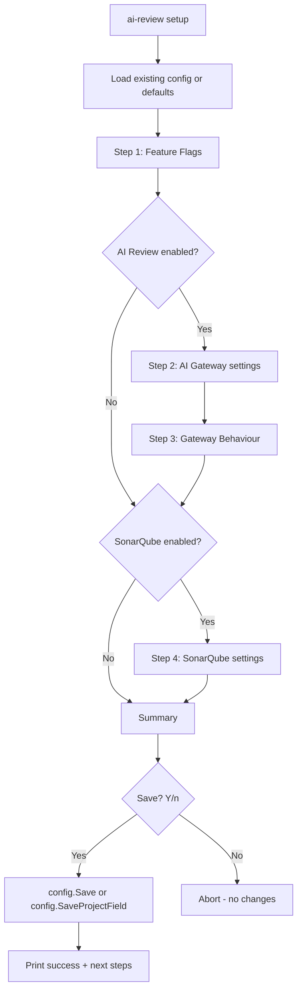

# Design: Setup Wizard

## Architecture Overview

The wizard is a single-command enhancement — no new packages or services. It modifies `go/internal/cmd/setup.go` to replace the current 4-field flow with a multi-step wizard.

## Data Models

No changes to `Config` struct — all 13 fields already exist in `go/internal/config/config.go`.

## Component Breakdown

### Modified: `go/internal/cmd/setup.go`

| Function | Responsibility |
|---|---|
| `runSetup` | Orchestrates the wizard steps, handles `--project` flag |
| `promptBool` | New helper: prompts `[Y/n]` or `[y/N]`, returns bool |
| `promptString` | Existing: prompts with default, returns string |
| `promptInt` | New helper: prompts for integer with default |
| `promptPassword` | Extracted from current inline code for API key |
| `printSummary` | New: renders the summary table before save |

### Unchanged: `go/internal/config/`

- `Save(cfg)` — writes to global config (already exists)
- `SaveProjectField(key, value)` — writes to project config (already exists)
- `LoadMerged()` — loads layered config (already exists)

## Design Decisions

1. **No TUI framework** — The existing `bufio.Reader` + `term.ReadPassword` pattern is sufficient. Adding a dependency like `survey` or `bubbletea` would increase binary size for minimal benefit.

2. **Conditional sections** — If `EnableAIReview` is false, skip steps 2-3 (AI Gateway + Gateway Behaviour). If `EnableSonarQube` is false, skip step 4. This avoids irrelevant questions.

3. **Re-prompt on required fields** — Required fields (Gateway URL, API Key, Sonar Host URL, Sonar Token, Sonar Project Key) re-prompt if the user presses Enter without an existing value.

4. **Summary before save** — Show all values (with masked secrets) and require explicit confirmation. This prevents accidental misconfiguration.

5. **`--project` flag on setup** — Declare a separate `setupProjectFlag` var registered on `setupCmd.Flags()`. Do NOT reuse `configProjectFlag` from config.go (cobra doesn't allow the same var on multiple commands).

6. **Boolean prompt convention** — Capital letter indicates default: `[Y/n]` means default=true, `[y/N]` means default=false. This is a standard Unix convention.

## Non-Functional Requirements

- **No network calls** — The wizard only reads/writes local files
- **Idempotent** — Running setup multiple times is safe; existing values are pre-filled
- **Cross-platform** — Password masking via `term.ReadPassword` works on Unix and Windows
