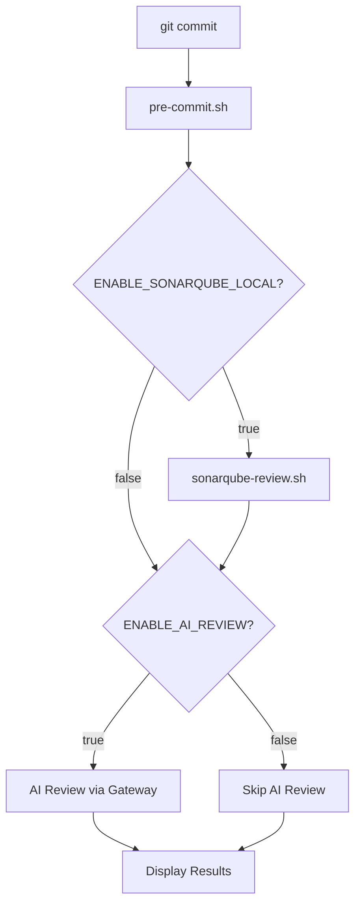

# Design - Toggle AI Review

## Architecture Overview



## Config Variable

| Variable | Type | Default | Location |
|----------|------|---------|----------|
| `ENABLE_AI_REVIEW` | string "true"/"false" | "true" | `$HOME/.config/ai-review/config` |

## Component Changes

### 1. `scripts/local/ai-review` (CLI)

**`cmd_setup()`**: Add prompt after AI Gateway credentials:
```
Enable AI Review for local commits? [Y/n]: y
```
Save `ENABLE_AI_REVIEW="true"` or `"false"` to config.

**`cmd_config()`**: Add `ENABLE_AI_REVIEW` to help text and config display.

### 2. `scripts/local/pre-commit.sh`

**`load_config()`**: Add default:
```bash
ENABLE_AI_REVIEW="${ENABLE_AI_REVIEW:-true}"
```

**Main flow**: Check `ENABLE_AI_REVIEW` before running AI review section. If disabled, show info message and skip.

### 3. `scripts/local/install.sh`

No changes needed - install doesn't configure AI review toggle. It's set during `ai-review setup`.

## Design Decisions

| Decision | Rationale |
|----------|-----------|
| Default `true` | Backward compatibility - existing users keep current behavior |
| Global only (not per-project) | Follows existing pattern; AI credentials are global |
| Still require credentials in setup | Credentials are stored for when user re-enables |
