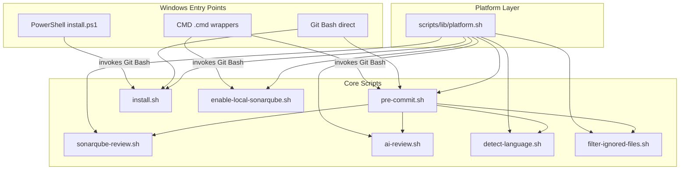

# Design - Update Review for Windows Environment

## Architecture Overview
**What is the high-level system structure?**

- **Platform abstraction**: `scripts/lib/platform.sh` provides OS detection and cross-platform utilities
- **Git Bash as runtime**: All bash scripts execute in Git Bash; PowerShell/CMD use wrapper scripts
- **Backward compatible**: Linux/macOS paths unchanged; Windows-specific code in conditional blocks

## Component Breakdown
**What are the major building blocks?**

### scripts/lib/platform.sh (NEW)
Central platform abstraction library sourced by all scripts:
- `detect_platform()` - Returns `macos`, `linux`, `wsl`, or `windows`
- `get_config_dir()` - Platform-appropriate config path
- `get_temp_dir()` - Platform-appropriate temp directory
- `safe_mktemp()` - Cross-platform temp file creation
- `safe_sed_inplace()` - Handles `sed -i` differences across macOS/Linux/Windows
- `check_color_support()` - Detects ANSI color support; sets NO_COLOR flag
- `strip_cr()` - Pipes input through `tr -d '\r'` for CRLF handling
- `check_required_tools()` - Validates tool availability with clear error messages
- `normalize_path()` - Converts Windows backslash paths to forward slashes

### Modified Scripts
Each script sources `platform.sh` and replaces OS-specific calls with platform functions.

## Design Decisions
**Why did we choose this approach?**

| Decision | Choice | Rationale |
|----------|--------|-----------|
| Runtime environment | Git Bash | Already a dependency (Git for Windows); avoids rewriting 2000+ lines of bash |
| Abstraction approach | Shared library | Centralizes platform logic; each script sources one file |
| PowerShell/CMD support | Wrapper scripts | Thin wrappers that locate and invoke Git Bash; minimal maintenance |
| WSL handling | Treat as Linux | WSL runs native Linux; no special handling needed |
| Color support | Runtime detection | Check terminal capabilities; disable gracefully if unsupported |

## Non-Functional Requirements
**How should the system perform?**

- **Performance**: Platform detection adds <50ms overhead per script invocation
- **Reliability**: Scripts fail gracefully with clear error messages when tools are missing
- **Maintainability**: All OS-specific logic in one file (`platform.sh`); easy to extend for new platforms
- **Security**: No changes to authentication, API key handling, or data flow
