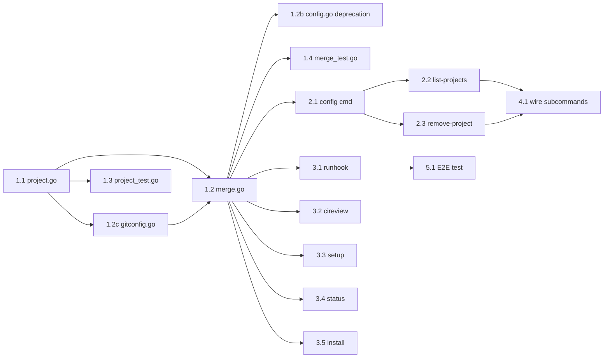

# Per-Project Configuration — Planning

## Milestones

- [x] Milestone 1: Core config layer — project identification, load/save, merge logic
- [x] Milestone 2: CLI integration — `config` command gains `--global`/`--project` flags, source annotations
- [x] Milestone 3: Hook integration — `run-hook`, `ci-review`, `setup`, `status`, `install` use merged config
- [x] Milestone 4: Project management commands — `config list-projects`, `config remove-project`
- [x] Milestone 5: Tests & documentation (E2E test deferred; bats tests added)

## Task Breakdown

### Phase 1: Core Config Layer

- [x] Task 1.1: Create `internal/config/project.go`
  - `ProjectID(repoRoot string) string` — SHA-256 hash, first 12 chars
  - `ProjectConfigDir() (string, error)` — resolves current repo root → project config dir
  - `LoadProjectRaw() (map[string]string, error)` — reads project config as raw key-value map
  - `SaveProjectField(key, value string) error` — writes a single key to project config, preserving existing keys
  - `RemoveProject(id string) error` — delete project config dir
  - `ListProjects() ([]ProjectInfo, error)` — scan `projects/` directory
- [x] Task 1.2: Create `internal/config/merge.go`
  - `DefaultsAsMap() map[string]string` — compiled defaults as raw map (exported)
  - `LoadGlobalRaw() (map[string]string, error)` — reads global config file only (exported)
  - `loadGitLocalAll() map[string]string` — reads all 13 `aireview.*` keys via batch `git config --local --list`
  - `loadEnvRaw() map[string]string` — reads config-relevant env vars
  - `LoadMerged() (*Config, error)` — full resolution: defaults ← global ← project ← git-local ← env
  - `LoadMergedWithSources() (map[string]ConfigSource, error)` — same but with source tracking
  - `AllConfigKeys() []string` — exported accessor for the 13 config key names
- [x] Task 1.2b: Update `internal/config/config.go`
  - Deprecated `Load()` → delegates to `LoadMerged()`
  - Deprecated `LoadWithRepoOverrides()` → delegates to `LoadMerged()`
  - Removed unused `gitLocalConfig()` wrapper and `applyEnvVars()` (logic moved to merge.go)
- [x] Task 1.2c: Update `internal/config/gitconfig.go`
  - Added `gitLocalKeyMap` mapping all 13 config keys → `aireview.*` camelCase keys
  - Added `loadGitLocalAll() map[string]string` — batch read via `git config --local --list` with reverse key mapping
- [x] Task 1.3: Create `internal/config/project_test.go`
  - Tests: ProjectID determinism, uniqueness, length, trailing slash
  - Tests: writePartialConfig round-trip
  - Tests: ListProjects (empty, multiple, skip without config, missing repo-path)
  - Tests: RemoveProject (exists, not found)
- [x] Task 1.4: Create `internal/config/merge_test.go`
  - Tests: DefaultsAsMap keys/values
  - Tests: LoadGlobalRaw (no file, with file)
  - Tests: loadEnvRaw (string keys, bool keys, invalid bool, timeout, invalid timeout)
  - Tests: LoadMerged (defaults only, global overrides, env overrides)
  - Tests: LoadMergedWithSources source labels
  - Tests: Boolean override (env false overrides global true)

### Phase 2: CLI Integration

- [x] Task 2.1: Update `internal/cmd/config.go`
  - Added `--global` and `--project` flags to `config set`
  - `runConfigShow()` shows source annotations (default/global/project/git-local/env)
  - Shows project config path when available
  - `config set` without flags: if project config exists → update project; otherwise → update global
- [x] Task 2.2: `config list-projects` subcommand (included in config.go rewrite)
  - Lists all projects with ID and repo path
  - Handles missing `repo-path` files gracefully
- [x] Task 2.3: `config remove-project` subcommand (included in config.go rewrite)
  - Accepts project ID or auto-detect from current repo

### Phase 3: Hook Integration

- [x] Task 3.1: Update `internal/cmd/runhook.go`
  - Replaced `LoadWithRepoOverrides()` → `LoadMerged()`
- [x] Task 3.2: Update `internal/cmd/cireview.go`
  - Replaced `Load()` → `LoadMerged()`
- [x] Task 3.3: Update `internal/cmd/setup.go`
  - Replaced `Load()` → `LoadMerged()` so project overrides are visible
- [x] Task 3.4: Update `internal/cmd/status.go`
  - Replaced `Load()` → `LoadMerged()`
  - Added project config path display when `ProjectConfigDir()` returns a value
- [x] Task 3.5: Update `internal/cmd/install.go`
  - Replaced `Load()` → `LoadMerged()`

### Phase 4: Project Management

- [x] Task 4.1: `list-projects` and `remove-project` wired as subcommands in config.go runConfig() switch
- [x] Task 4.2: Update `install.sh` `print_next_steps()` to mention `config set --project`
  - Added step 5 with `--project` examples for AI_MODEL, AI_PROVIDER, ENABLE_AI_REVIEW

### Phase 5: Tests & Documentation

- [ ] Task 5.1: ~~Add E2E test for project config workflow~~ (deferred — requires compiled binary + git repo; Go unit tests cover merge logic with 35 tests)
- [x] Task 5.2: Update `install.sh` next steps to mention per-project config (combined with 4.2)
- [x] Task 5.3: Add bats test for `print_next_steps` output
  - 3 tests: `--project` flag, SonarQube config, AI review config — all passing

## Dependencies

- Phase 1 (core) has no external dependencies — pure Go
- Phase 2 depends on Phase 1 (needs merge logic)
- Phase 3 depends on Phase 1 (needs `LoadMerged()`)
- Phase 4 depends on Phase 2
- Phase 5 depends on Phase 3

## Risks & Mitigation

| Risk | Impact | Mitigation |
|------|--------|------------|
| Symlink resolution differs across OS | Wrong project ID | Use `filepath.EvalSymlinks()` + `filepath.Clean()`, add tests on CI matrix |
| Hash collision between projects | Wrong config loaded | 12 hex chars = 48-bit, collision at ~16M projects; effectively zero risk |
| Breaking existing `LoadWithRepoOverrides()` callers | Review fails silently | Keep `LoadWithRepoOverrides()` as deprecated wrapper around `LoadMerged()` |
| Windows `%APPDATA%` path handling | Config not found | Reuse existing `ConfigDir()` which already handles Windows |
| Boolean zero-value merge bug | Wrong config value | Map-level merging avoids struct zero-value issue entirely |
